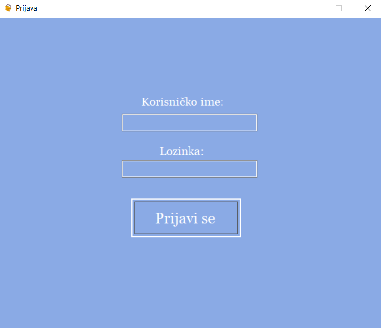
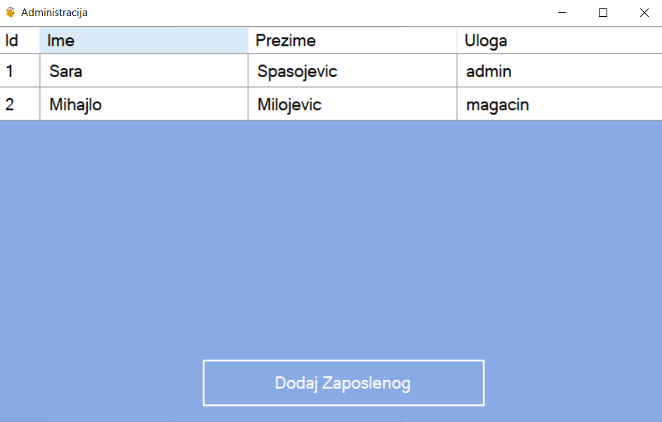
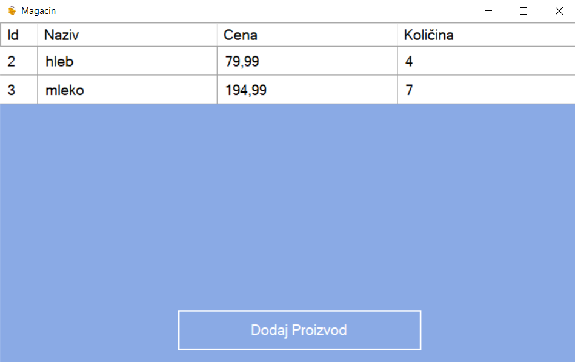

# Prodavnica

Jednostavna C# Windows Form Aplikacija koja omogućava rad prodavnice. Sistem prepoznaje dve vrste korisnika: admina koji upravlja zaposlenima; i magacionera koji upravlja proizvodima. Podaci se čuvaju u txt fajlovima.

Ovaj projekat nastao je kao zadatak za kraj polugodišta na predmetu Programiranje u 4. razredu srednje škole.

## Prikaz

<i>početna - forma za prijavu<i>

<i>adminska stranica - prikaz zaposlenih<i>

<i>forma za dodavanje zaposlenog<i>

<i>forma za izmenu i brisanje zaposlenog<i>

<i>magacionerska stranica - prikaz svih proizvoda<i>

<i>forma za dodavanja proizvoda<i>

<i>forma za izmenu i brisanje proizvoda<i>
